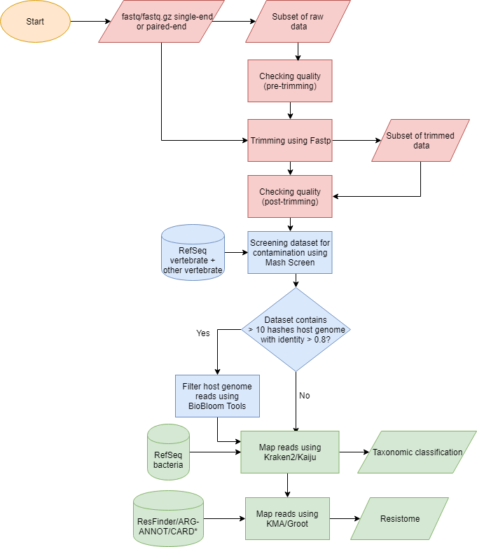

# FastDeMe

A fast, easy solution for metagenomic data analysis. An outline of the program is given below:



A report of FastDeme containing some benchmarks can be found here: [Sander Vermeulen report](http://https://github.com/aldertzomer/FastDeMe/blob/master/Report%20Sander%20Vermeulen.pdf)

## Installation

The program can be downloaded as an archive or with the following git command:

`git clone <github_link>`

Next, the databases should be downloaded. This can be done by running `getdb.sh` located in the `db/` directory. This will download the four databases that are needed for the program to run and unzip them. Please make sure enough space is available on the drive, since the combined size of the databases is ~165 GB. The combined download size is ~116 GB.

After downloading, the program can be invoked with `wrapper.py`.

## Usage
The program has two mandatory arguments, `--inp` and `--output`. To use the basic version of the program, the following command can be ran:

`./wrapper.py --inp file.fastq.gz --output /path/to/output/folder/ --trimming`

This will only result in the file getting trimmed.

To trim, screen the input files for host contamination, perform taxonomic identification with Kaiju and analyse the resistome with GROOT the following command can be used:

`./wrapper.py --pe --inp file_R1.fastq.gz file_R2.fastq.gz --output /path/to/output/folder/ --trimming --screening --kaiju --groot`

The flag `--pe` is needed when using paired end files. `--kaiju`, `--groot`, `--kraken` `--trimming`, `--kma` and `--screening` turn on the respective modules. 

16 CPU cores will be used by default. To limit or increase the amount of CPU cores used, one can use `--threads`. Note that trimming will not use more than 16 cores, even when more are specified.

## Database information
### GROOT

The GROOT database consist of a mixture of the ResFinder, ARG-ANNOT and CARD databases. See the [GROOT documentation](https://groot-documentation.readthedocs.io/en/latest/groot-databases.html) for more details.

### KMA

The KMA database consist of the ResFinder database.

### Kaiju

The Kaiju database was made with assembled and annotated bacterial reference genomes from the NCBI RefSeq database.

### Kraken2

The Kraken2 database was made with the complete bacterial reference genomes from the NCBI RefSeq database.

### Mash/BioBloomCategorizer

The Mash database was made from the complete vertebrate_mammalian and vertebrate_other databases from NCBI RefSeq. Since the bloom filters BioBloomCategorizer uses for filtering the host reads are quite large, only filters for common host species are included in the standard database to reduce download size.

Species in standard database|GCF ID
--------------|----------------
*Bos indicus*|GCF_000247795.1
*Bos mutus*|GCF_000298355.1
*Bos taurus*|GCF_002263795.1
*Canis lupus familiaris*|GCF_000002285.3
*Capra hircus*|GCF_001704415.1
*Chinchilla lanigera*|GCF_000276665.1
*Equus caballus*|GCF_002863925.1
*Felis catus*|GCF_000181335.3
*Gorilla gorilla gorilla*|GCF_000151905.2
*Homo sapiens*|GCF_000001405.38
*Mus musculus*|GCF_000001635.26
*Ovis aries*|GCF_000298735.2
*Ovis aries musimon*|GCF_000765115.1
*Pan troglodytes*|GCF_002880755.1
*Rattus norvegicus*|GCF_000001895.5, GCF_000002265.2
*Sus scrofa*|GCF_000003025.6
*Danio rerio*|GCF_000002035.6
*Gallus gallus*|GCF_000002315.5
*Meleagris gallopavo*|GCF_000146605.2

In case contamination is detected and the host is not in the standard database, the corresponding bloom filter will be downloaded automatically.

## Output
Output obviously depends on what modules are used for analysis. The following files are expected as output for each module:

### Trimming
QC report

`<prefix>_QC_results.txt`

For paired end:

`<prefix>_trimmed_1.fastq.gz`

`<prefix>_trimmed_2.fastq.gz`

For single end:

`<prefix>_trimmed.fastq.gz`

### Screening
For paired end:

`<prefix>_noMatch_1.fastq`

`<prefix>_noMatch_2.fastq`

`<prefix>_GCF*.fna.gz_1.`

`<prefix>_GCF*.fna.gz_2.`

For single end:

`<prefix>_noMatch.fastq`

`<prefix>_GCF*.fna.gz.`

These files contain the (trimmed) fastq files with removed host DNA (`noMatch`) and the removed host reads (`GCF`).

### Kaiju
Output for Kaiju depends on which taxonomic rank is selected. 

`<prefix>_<tax_rank>_kaiju_summary.txt`

These files contain the names and abundance of the selected taxonomic ranks in the samples.

### Kraken2
Output for Kraken2 depends on which taxonomic rank is selected.

`<prefix>_<tax_rank>.bracken`

Contains output of Bracken, sorted by taxonomic rank.

`<prefix>_kraken_report.txt`

Contains output of Kraken2.

`<prefix>_kraken_report_bracken.txt`

Contains all output of Bracken. 

### GROOT
`<prefix>_groot_report.txt`

Contains information about the found antibiotic resistance genes.

`/output_folder/<prefix>_groot/`

Folder with `.gfa` files of the found antibioitc resistance genes.

### KMA
`<prefix>_kma.aln`

Contains  alignments of resistance genes against input.

`<prefix>_kma.fsa`

Contains sequences of found resistance genes in FASTA format.

`<prefix>_kma.res`

Contains information about the found antibiotic resistance genes.

## Options
```
usage: wrapper.py --inp file.fastq.gz --output /path/to/output/folder/ [OPTIONS]

  -h, --help           show this help message and exit  
  --pe                 specify paired-end data, default is single end  
  --inp INP [INP ...]  input files in fastq.gz format, if paired-end input  
                       both files with a space between them                       
  --threads THREADS    specify number of threads to be used, default is max
                       available threads up to 16 threads                       
  --kaiju              use kaiju for taxonomic identification  
  --kraken             use kraken2 for taxonomic identification  
  --groot              use groot for resistome analysis
  --kma                use kma for resistome analysis
  --tax_rank TAX_RANK  set taxonomic rank for output. choose one: phylum,
                       class, order, family, genus, species, default is all
                       ranks.                       
  --prefix PREFIX      prefix for all output files, default is name of input
                       file(s)                       
  --trimming           turn on trimming with fastp  
  --screening          turn on host contamination screening with mash and
                       BioBloomCategorizer                       
  --output OUTPUT      set output directory
```
## License

## Acknowledgments

### Fastp
Shifu Chen, Yanqing Zhou, Yaru Chen, Jia Gu; fastp: an ultra-fast all-in-one FASTQ preprocessor,  Bioinformatics, Volume 34, Issue 17, 1 September 2018, Pages i884–i890, [paper](https://doi.org/10.1093/bioinformatics/bty560)

[GitHub](https://github.com/OpenGene/fastp)

### Mash
Mash: fast genome and metagenome distance estimation using MinHash. Ondov BD, Treangen TJ, Melsted P, Mallonee AB, Bergman NH, Koren S, Phillippy AM. Genome Biol. 2016 Jun 20;17(1):132. [paper](https://doi.org/10.1186/s13059-016-0997-x)

[GitHub](https://github.com/marbl/Mash)

### BioBloom Tools
BioBloom tools: fast, accurate and memory-efficient host species sequence screening using bloom filters.
Justin Chu, Sara Sadeghi, Anthony Raymond, Shaun D. Jackman, Ka Ming Nip, Richard Mar, Hamid Mohamadi, Yaron S. Butterfield, A. Gordon Robertson, Inanç Birol. Bioinformatics 2014; 30 (23): 3402-3404. [paper](https://doi.org/10.1093/bioinformatics/btu558)

[GitHub](https://github.com/bcgsc/biobloom)

### Kraken2
Wood DE, Salzberg SL: Kraken: ultrafast metagenomic sequence classification using exact alignments. Genome Biology 2014, 15:R46. [paper](https://doi.org/10.1186/gb-2014-15-3-r46) 

[GitHub](https://github.com/DerrickWood/kraken2)

### Bracken
Lu J, Breitwieser FP, Thielen P, Salzberg SL. 2017. Bracken: estimating species abundance in metagenomics data. PeerJ Computer Science 3:e104 [paper](https://doi.org/10.7717/peerj-cs.104)

[GitHub](https://github.com/jenniferlu717/Bracken)

### Kaiju
Menzel, P. et al. (2016) Fast and sensitive taxonomic classification for metagenomics with Kaiju. Nat. Commun. 7:11257 [paper](https://doi.org/10.1038/ncomms11257)

[GitHub](https://github.com/bioinformatics-centre/kaiju)

### GROOT
Will P M Rowe, Martyn D Winn; Indexed variation graphs for efficient and accurate resistome profiling, Bioinformatics, Volume 34, Issue 21, 1 November 2018, Pages 3601–3608, [paper](https://doi.org/10.1093/bioinformatics/bty387)

[GitHub](https://github.com/will-rowe/groot)

### KMA
Philip T.L.C. Clausen, Frank M. Aarestrup & Ole Lund, "Rapid and precise alignment of raw reads against redundant databases with KMA", BMC Bioinformatics, 2018;19:307. [paper](https://doi.org/10.1186/s12859-018-2336-6)

[BitBucket](https://bitbucket.org/genomicepidemiology/kma)


